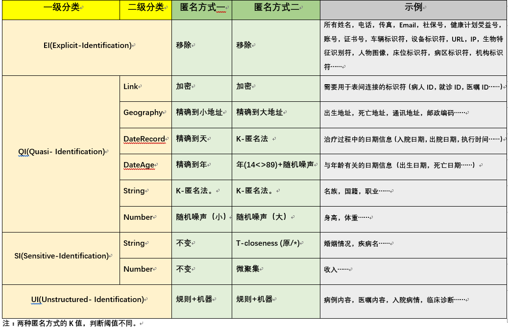

# DataAnonymization
一个医疗数据匿名化工具网站。
参考Openehr,HIPAA,GDPR,ISO-20889,国标-个人信息安全规范等法律和规范。

##字段分类处理标准
 
> 一级分类
>>**EI显示标识符(Explicit-Identifier)**:
显示标识符可直接表示出个体身份的属性，如身份证号、社保号、姓名等。
一般在数据发布前将显示标识符属性屏蔽、删除或加密，达到保护这些私有信息的目的。

>>**QI准标识符(Quasi-Identifier)**:
假定一个实体集U，一个特定的实体表T(A1,A2,…,An)，fc：U→T以及fg：T→U′其中UU′。
T 的一个准标识符QIT，是一组属性{Ai,…,Aj} {A1,A2,…,An} ∃pi∈U，那么fg(fc(pi)[QT]) = pi成立。
简单的来说就是攻击者可以根据准标识符推断出个体身份。表中的属性都可以为准标识符。
一般情况下，准标识符的选取是由具有经验的专家或根据实际需要选择。

>>**SI敏感属性(Sensitive-Identifier Attribute)**：
敏感属性即为敏感信息，涉及个体隐私，如身体健康状况、薪水等。
对于一个属性来说，什么时候作为准标识符属性和什么时候作为敏感属性不是一成不变的。
例如，属性marital-status（婚姻状况）若只有Married（已婚）和Unmarried （未婚）两个属性值，可以不作为敏感属性，
若属性值为Divorced（已离婚）、Never-married （单身）、Separated（分居）、Widowed（丧偶）、Married（已婚）等，
就很有可能成为敏感属性。

>>**UI非结构化属性(Unstructured-Identifer)**:
在医疗领域大量的数据存在于非结构化文本中，如入院记录、出院记录等。对这些数据进行去标识化是十分重要的。

>>**NI非敏感属性(Nonsensitive-Identifier Attribute)**:
非敏感属性即为非敏感信息，单一的属性可作为非敏感属性，但若多个非敏感属性组合就有可能成为准标识符，
如只有Birth（出生年份）属性，就不具备敏感性，但若Name(姓名)属性同时出现，就会成为准标识符，
因为属性Name和Birth一旦形成匹配，很有可能获得更多的信息，导致隐私信息（敏感属性值）的泄露。

>二级分类
>>**EI**:由于显示标识符会直接表示个体身份，因此统一进行移除处理，不做细节的二级分类。

>>**QI**：对于准标识符，需要进行一定程度的匿名处理，使得攻击者无法推断出个体，因此对于不同类型准标识符，将采用不同处理方式。
>>>**Link**:链接型数据，如病人ID等。这类数据可以推断出个体，但其又往往用于表单之间的链接，不能直接移除。

>>>**Geography**:地理型数据，如出生地址。如美国HIPPA法案规定：所有小于州的地理细分，包括街道地址，城市，县，区，邮政编码及其等效地理编码，
只保留邮政编码的前三位数字，另外其以20000人口为界限，隐藏小于该人口数量的地理位置。而本工程以200000人口、市级为分界线，将地理信息分为3类，
及大地址、小地址和不可用地址。

>>>**DateRecord**:用于表示一般记录的时间信息，如入院信息等。该类时间信息的日期往往对研究比较重要。

>>>**DateAge**:用于表示个体的特殊时间信息，如出生日期等。该类时间信息往往与个体的关联性比较大，且具体的日期对于研究重要性不大。

>>>**String**:用于表示剩余的字符类型信息，如国籍等。如有必要可以从中再分离出特定的分类。

>>>**Number**:用于表示剩余的数值型信息，如身高、体重等。如有必要可以从中再分离出特定的分类。

>>**SI**：对于敏感信息，由于一个属性是否为敏感属性比较模糊，因此其的二级分类也比较模糊。

>>>**String**:用于表示敏感信息中的字符串类型信息。

>>>**Number**:用于表示敏感信息中的数值类型信息。

>**处理方式**：

>>**移除**：该方法直接将目标字段移除，改用"***"表示。

>>**加密**：本工程中使用3DES进行加密处理，并以16进制显示，密码通过用户设置和内置密码组合的方式形成。

>>**地理缩放**：以200,000人口和市级为分界线，将不在地理表单中的地理信息移除。对于邮编，则将其末尾3位隐藏。

>>**时间处理**：对于QI_DateRecord数据进行保留到天和K-匿名法。对于QI_DateAge数据进行保留到年和保留到年并加噪声处理对于小于14年和大于89的时间进行特别处理。
[HIPPA](https://www.hhs.gov/hipaa/index.html)法案中规定对于所有超过89年的日期可以被聚合成90岁或更大的单个类别。
[GDPR](https://www.eugdpr.org/)则规定小于16岁，需要监护人许可。
[国标-个人信息安全规范](http://c.gb688.cn/bzgk/gb/showGb?type=online&hcno=4FFAA51D63BA21B9EE40C51DD3CC40BE)则规定小于14岁，需要监护人许可。

>>**随机噪声**：本工程采用Laplace噪声处理，噪声浮动范围可以进行人为设置。

>>**K-匿名法**：[K-anonimity](https://epic.org/privacy/reidentification/Sweeney_Article.pdf)假设T(A1,A2,…,An)是一个表，QI是与T相关联的准标识符，当且仅当在T[QI]中出现的每一个有序的值至少在T[QI]中出现k次，则T满足K-匿名。
K-匿名实质就是要求在一个集合（数据集）中只能以不大于1/k（k是一个常数）的概率确定任何一个元素（记录），即要求任何一个元素（记录），在集合中至少存在k-1 个相同副本元素。
本工程K-匿名法通过[Flash](https://ieeexplore.ieee.org/document/6406297/)算法实现。

>>**T-closeness**:[t-closeness](https://ieeexplore.ieee.org/document/4221659/)模型由LiNinghui 等人提出。
它要求每个等价类的敏感值的分布要接近于原始数据表中敏感属性的发布即要求等价组内敏感属性值的分布与其整体分布的差异不超过t。

>>**微聚集**：[Microaggregation](https://link.springer.com/referenceworkentry/10.1007%2F978-0-387-39940-9_1496)，
基本思想是根据数据的相似或相近程度划分每个类，类内的元组数至少为k个，用类质心（如均值）代表所划分类内元组的值。

>>**规则与机器学习**：未完成。